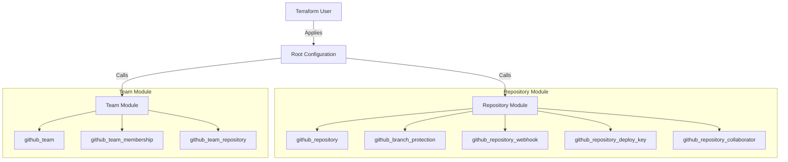

# SCM-as-Code: GitHub Infrastructure as Code

[](https://www.terraform.io/)
[](https://github.com/)

A comprehensive, modular, and secure Terraform solution for managing GitHub organizations, repositories, teams, and access controls as code. Designed for enterprise scalability and security best practices.

## 🏗️ Architecture

This project uses a modular architecture to allow flexible composition of resources.



## 📂 Directory Structure

```
.
├── modules/                 # Reusable Terraform modules
│   ├── repository/          # Comprehensive repository management
│   ├── team/                # Team and membership management
│   ├── runner_group/        # Self-hosted runner group management
│   └── ...                  # Granular resource modules
├── working_examples/        # Enterprise-grade example configurations
│   ├── create-repository/   # Complete setup for new repositories
│   └── manage-existing-repository/ # Import and manage existing repos
```

## 🚀 Modules

| Module | Description | Individual | Organization |
| :--- | :--- | :---: | :---: |
| [`repository`](./modules/repository) | Full repository lifecycle management (protection, keys, webhooks). | ✅ | ✅ |
| [`team`](./modules/team) | Team creation, membership, and repository access. | ❌ | ✅ |
| [`runner_group`](./modules/runner_group) | Management of Actions self-hosted runner groups. | ❌ | ✅ |
| [`branch_protection`](./modules/branch_protection) | Standalone branch protection rules. | ✅ | ✅ |

> **Note**: Secret and Variable management modules are intentionally excluded to prevent sensitive data exposure in Terraform state. Use a dedicated secret manager (e.g., Vault) or GitHub's UI/CLI for secrets.

## 💻 Usage

### Prerequisites
- [Terraform](https://www.terraform.io/downloads.html) >= 1.0
- [GitHub Provider](https://registry.terraform.io/providers/integrations/github/latest) >= 6.0
- A GitHub Personal Access Token (PAT) with appropriate permissions (`repo`, `admin:org`, `delete_repo`).

### Quick Start

1.  **Clone the repository:**
    ```bash
    git clone https://github.com/shivworld007/SCM-as-Code.git
    cd SCM-as-Code
    ```

2.  **Navigate to an example:**
    ```bash
    cd working_examples/create-repository
    ```

3.  **Configure variables:**
    Copy the example `tfvars` file and update it with your values.
    ```bash
    cp terraform.tfvars.example terraform.tfvars
    # Edit terraform.tfvars
    ```

4.  **Initialize and Apply:**
    ```bash
    terraform init
    terraform apply
    ```

## 🛡️ Best Practices implemented

- **Modularity**: Granular modules allow managing specific resources (like just branch protection) without taking over the entire repository.
- **Security**: No secrets in state. Least privilege principles for PATs recommended.
- **Structure**: Examples follow enterprise standards with split files (`providers.tf`, `versions.tf`, `variables.tf`, `outputs.tf`).

## 🤝 Contributing

Contributions are welcome! Please submit a Pull Request.
