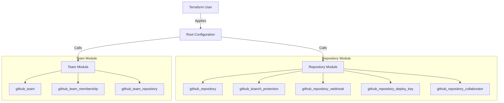

# SCM-as-Code: GitHub Infrastructure as Code

[](https://www.terraform.io/)
[](https://github.com/)
[](https://github.com/shivworld007/SCM-as-Code/actions/workflows/terraform.yml)

A comprehensive, modular, and secure Terraform solution for managing GitHub organizations, repositories, teams, and access controls as code. Designed for enterprise scalability and security best practices.

## 🏗️ Architecture

This project uses a modular architecture to allow flexible composition of resources.



## 📂 Directory Structure

```
.
├── modules/                 # Reusable Terraform modules
│   ├── repository/          # Comprehensive repository management
│   ├── team/                # Team and membership management
│   ├── runner_group/        # Self-hosted runner group management
│   └── ...                  # Granular resource modules
├── working_examples/        # Enterprise-grade example configurations
│   ├── create-repository/   # Complete setup for new repositories
│   └── manage-existing-repository/ # Import and manage existing repos
```

## 🔐 Authentication & Permissions

To use these modules, you need to authenticate with GitHub using a Personal Access Token (PAT).

### 1. Create a Personal Access Token (PAT)
1.  Go to **Settings** > **Developer settings** > **Personal access tokens** > **Tokens (classic)**.
2.  Generate a new token with the following scopes:

| Scope | Reason |
| :--- | :--- |
| `repo` | Full control of private repositories (includes `repo:status`, `repo_deployment`, etc). |
| `admin:org` | Required to manage Teams and Organization settings. |
| `delete_repo` | Required to destroy repositories via Terraform. |
| `workflow` | Required to manage GitHub Actions workflows and runner groups. |

### 2. Configure Environment Variable
It is best practice to pass the token as an environment variable rather than hardcoding it.

```bash
export GITHUB_TOKEN="ghp_xxxxxxxxxxxxxxxxxxxxxxxxxxxx"
export GITHUB_OWNER="my-org-name"
```

> [!WARNING]
> **Security Notice**: Never commit your `terraform.tfvars` file containing secrets or tokens to version control. Ensure it is listed in your `.gitignore`.

## 🚀 Modules Compatibility

Different modules require different account types.

| Module | Description | Individual Account | Organization Account | Notes |
| :--- | :--- | :---: | :---: | :--- |
| [`repository`](./modules/repository) | Full repository lifecycle management. | ✅ | ✅ | Works for both User and Org repos. |
| [`team`](./modules/team) | Team creation & membership. | ❌ | ✅ | **Teams are an Organization-only feature.** |
| [`runner_group`](./modules/runner_group) | Self-hosted runner groups. | ❌ | ✅ | **Runner Groups are an Organization-only feature.** |
| [`branch_protection`](./modules/branch_protection) | Branch protection rules. | ✅ | ✅ | Requires Pro/Team plan for private repos. |

## 💻 Usage

### Prerequisites
- [Terraform](https://www.terraform.io/downloads.html) >= 1.0
- [GitHub Provider](https://registry.terraform.io/providers/integrations/github/latest) >= 6.0

### Quick Start

1.  **Clone the repository:**
    ```bash
    git clone https://github.com/shivworld007/SCM-as-Code.git
    cd SCM-as-Code
    ```

2.  **Navigate to an example:**
    ```bash
    cd working_examples/create-repository
    ```

3.  **Configure variables:**
    Copy the example `tfvars` file and update it with your values.
    ```bash
    cp terraform.tfvars.example terraform.tfvars
    # Edit terraform.tfvars
    ```

4.  **Initialize and Apply:**
    ```bash
    export GITHUB_TOKEN="your-pat-token"
    terraform init
    terraform apply
    ```

### Cleanup / Destroy
To safely tear down the infrastructure:
```bash
terraform destroy
```
> **Note**: This will permanently delete the repositories and resources managed by Terraform.

## 📦 Versioning

This project follows [Semantic Versioning](https://semver.org/).
- **v1.0.0**: Initial stable release with core modules and examples.

See [CHANGELOG.md](./CHANGELOG.md) for details.

## 🛡️ Best Practices implemented

- **Modularity**: Granular modules allow managing specific resources (like just branch protection) without taking over the entire repository.
- **Security**: No secrets in state. Least privilege principles for PATs recommended.
- **Structure**: Examples follow enterprise standards with split files (`providers.tf`, `versions.tf`, `variables.tf`, `outputs.tf`).

## 🤝 Contributing

Contributions are welcome! Please submit a Pull Request. See [CONTRIBUTING.md](./CONTRIBUTING.md) for details.
